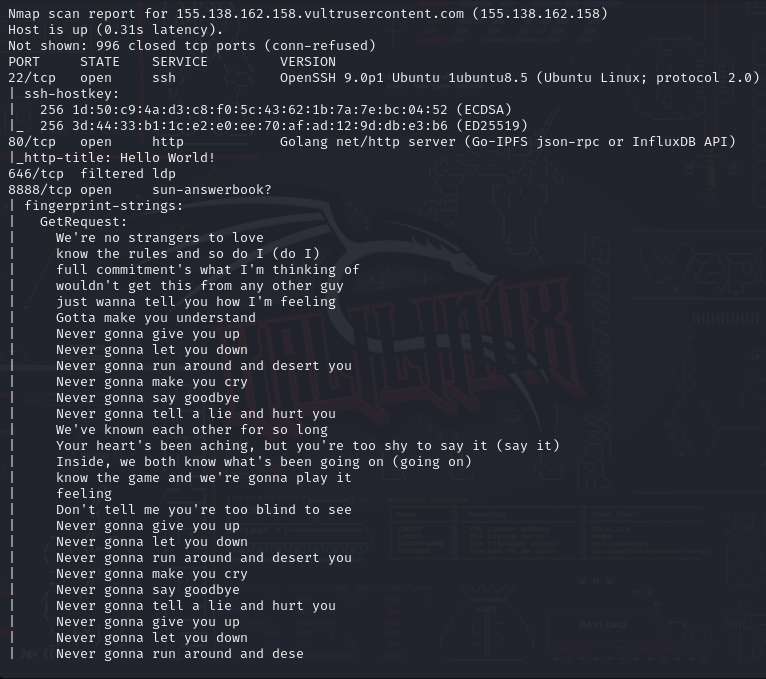
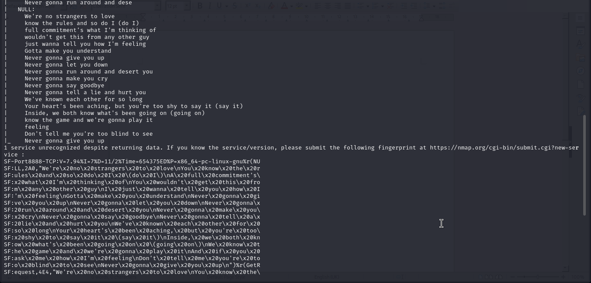
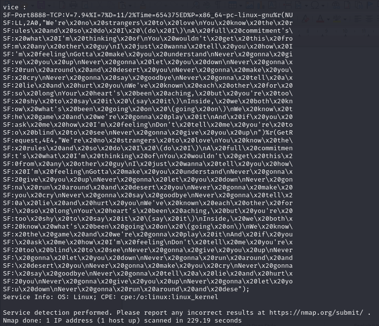
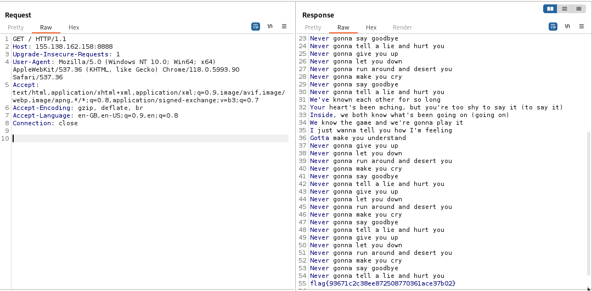

## Question
Author: @proslasher

OK Go take a look at this IP:
Connect here: http://155.138.162.158
# USING ANY OTHER TOOL OTHER THAN NMAP WILL DISQUALIFY YOU. DON'T USE BURPSUITE, DON'T USE DIRBUSTER. JUST PLAIN NMAP, NO FLAGS!

## Solution
Running Nmap, we get the following output:

The interesting part is found on port 8888. Keying in the IP along with port 8888, the lyrics of I Wont Let You Down are displayed line by line. However, towards the end, the flag is displayed and quickly disappears.

I used BurpSuite capture the request and send a response. The trick in doing this is the flag is displayed but it won't disappear.

If the flag doesn't appear after sending the first response, send another one.

flag{93671c2c38ee872508770361ace37b02}
