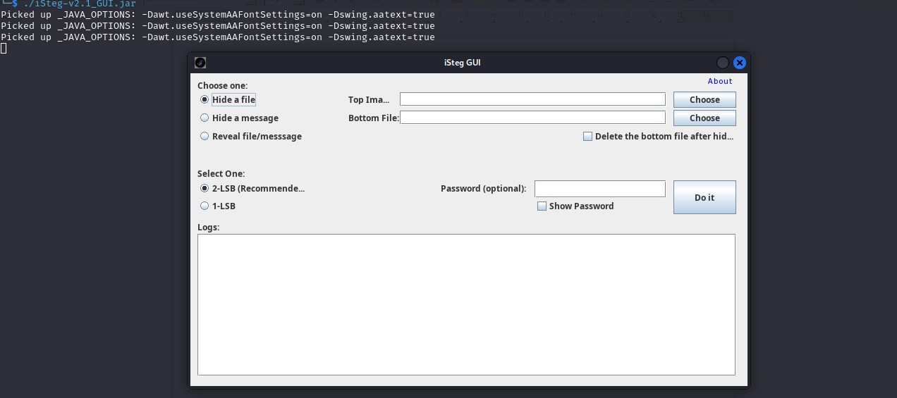
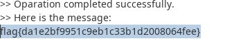

## Question
Author: @proslasher

This trick is nothing new, you know what to do: iSteg. Look for the tail that's older than time, this Spike, you shouldn't climb.
File:

## Solution
Based of the hint **iSteg**, I did a little research and came across this repository:https://github.com/rafiibrahim8/iSteg

Downloading the GUI jar file from the repository, I was greeted with this interface:

Choosing **Reveal file/message** option then selecting dinosaurs1.png file then click on **Do it**, you get the flag as shown:

flag{da1e2bf9951c9eb1c33b1d2008064fee}