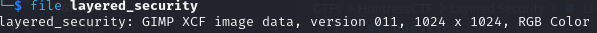
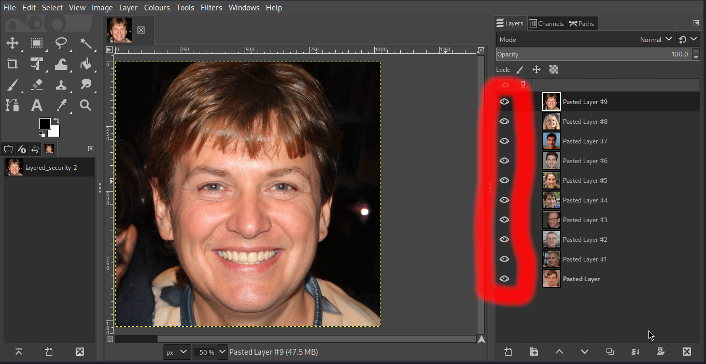
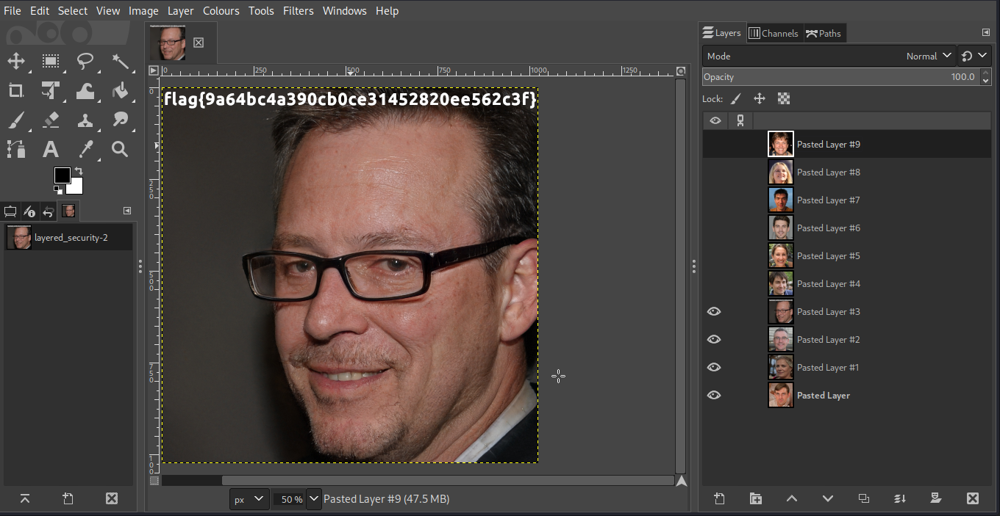

## Question
Author: @JohnHammond

It takes a team to do security right, so we have layered our defenses!
File:layered_security

## Solution
Checking the file type, you realize that it is an image file.

Opening the file using GNU Image Manipulation Program, you realize that there are 10 images stacked on top of each other. Clicking on the **eye** icon as shown below hides an image.

Hide each image until you find one with the flag shown on top of it.

flag{9a64bc4a390cb0ce31452820ee562c3f}