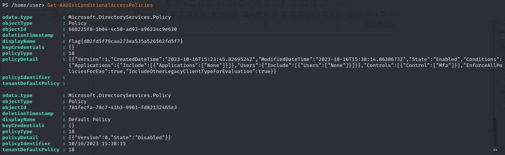

## Question
Author: @David Carter
This tenant looks to have some odd Conditional Access Policies. Can you find a weird one?

## Solution
From the AADInternals Documentation:
"
Get-AADIntConditionalAccessPolicies (A)

# List the conditional access policies
Get-AADIntConditionalAccessPolicies
"
Run the second command i.e. **Get-AADIntConditionalAccessPolicies**. Check displayName property for the flag

flag{d02fd5f79caa273ea535a526562fd5f7}
