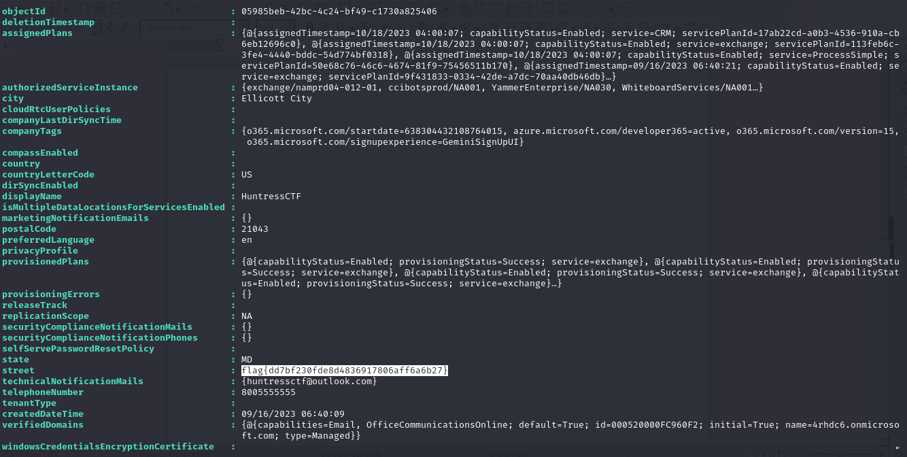

## Question
Author: @David Carter
Welcome to our hackable M365 tenant! Can you find any juicy details, like perhaps the street address this organization is associated with?

## Solution
From the AADInternals Documentation:
"

Get-AADIntTenantDetails (A)

# Get tenant details
  Get-AADIntTenantDetails
"

Run the command after connecting. Scroll to where the street address is displayed and you get the flag

flag{dd7bf230fde8d4836917806aff6a6b27}