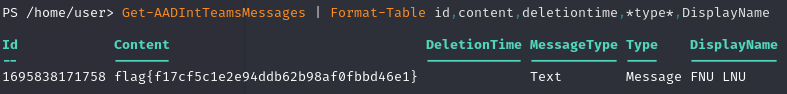

## Question
Author: @David Carter
We observed saw some sensitive information being shared over a Microsoft Teams message! Can you track it down? 

## Solution
From the AADInternals Documentation:
"
Get-AADIntTeamsMessages (T)

# Get Teams messages
Get-AADIntTeamsMessages | Format-Table id,content,deletiontime,*type*,DisplayName
"
Running the above command, you get the flag.

flag{f17cf5c1e2e94ddb62b98af0fbbd46e1}