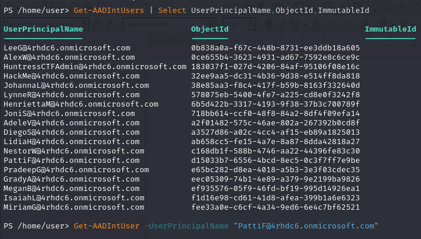
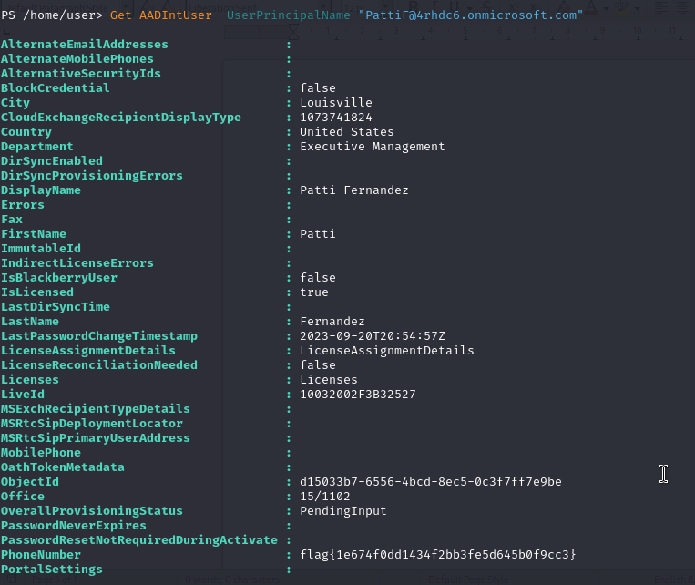

## Question
Author: @David Carter
One of the users in this environment seems to have unintentionally left some information in their account details. Can you track down The President?

## Solution
From the AADInternals Documentation:
"
# Get users
Get-AADIntUsers | Select UserPrincipalName,ObjectId,ImmutableId

# Get user information
Get-AADIntUser -UserPrincipalName "LeeG@company.com"

"

We use the above commands to get the users of the tenant then view user information of each user for a flag.

flag{1e674f0dd1434f2bb3fe5d645b0f9cc3}