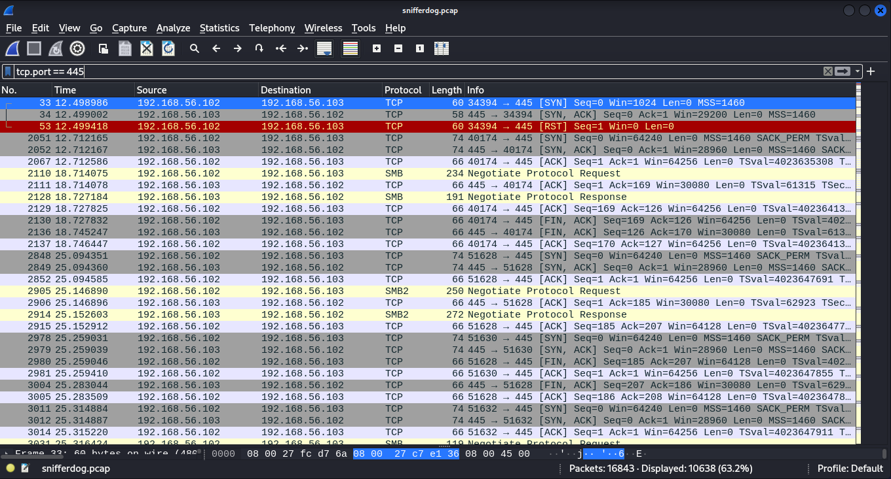

## Question
How many packets in total passed through port 445 shctf{Ans}
File: snifferdog.pcap

## Solution
Open the file using Wireshark.
Use this display filter: "tcp.port == 445". This tells Wireshark to filter out packets that don't pass through port 445.

Look at the bottom part of the Wireshark window and take note of the displayed packets i.e. "Displayed: 10638"

SHCTF{10638}