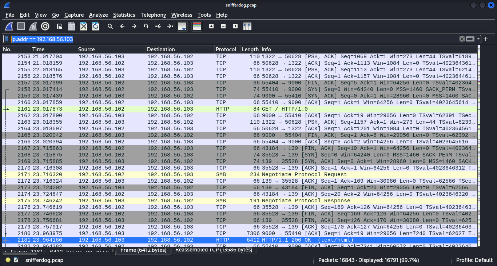
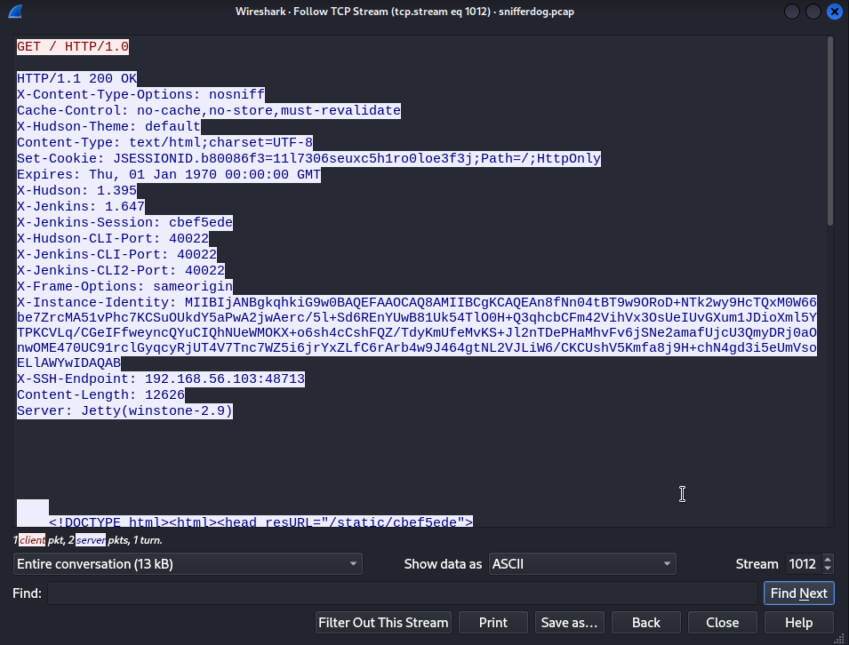

## Question
What version of Jenkins is running on 192.168.56.103? shctf{VersionOnly}

## Solution
Display filter: "ip.addr == 192.168.56.103"

Follow TCP stream of selected packet i.e. No.2181

Pay attention to "X-Jenkins: 1.647"

SHCTF{1.647}